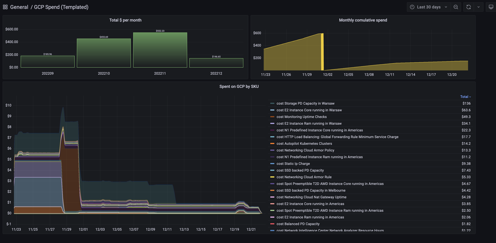

# Google Cloud Cost and Usage Grafana Dashboard

## Dashboard
This repo provides Grafana dashboard code which helps to visualize Google Cloud Cost and Usage report.

## Prerequisites

To run this dasboard to you need to:
1. Export Google Cloud Cost and Usage to BigQuery ([how-to](https://cloud.google.com/billing/docs/how-to/export-data-bigquery))
2. Install BigQuery plugin to your Grafana setup ([hwo-to](https://grafana.com/grafana/plugins/doitintl-bigquery-datasource/))
3. Import dashboard [GCP_Cost_and_Usage_v2.json](GCP_Cost_and_Usage_v2.json). You will need to provide project, table and dataset IDs, from the first step.

## Alternatives/extra
[Looker](https://cloud.google.com/billing/docs/how-to/visualize-data) dasboard with analytical capabilties.

## Support
Dashboard is build as personal project, support is best effort support.

### Updates
Dasboard is very basic, and it will improve over time. Star the repo to get new updates.

### Feedback

Please leave your feedback in the
[issue tracker](https://github.com/wizardmatas/googlecloud-grafana-costandusage-dashboard/issues)!
I'd love to know how you're using this tool and what features you'd like to see
us add.

### Code
If you spot a bug or see a typo, please feel free to fix it by putting up a
[pull request](https://github.com/wizardmatas/googlecloud-grafana-costandusage-dashboard/pulls)!
